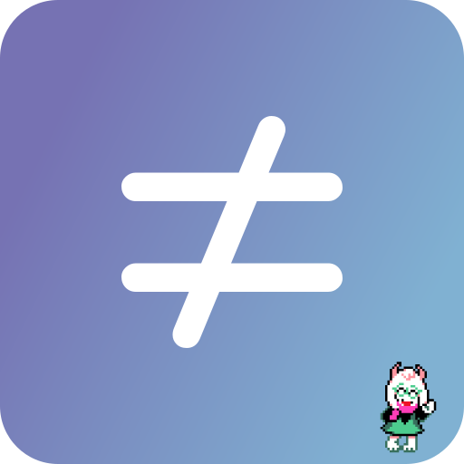

  

 

Minecraft launcher, but different.

This is a **fork** of the PolyMC Launcher and not endorsed by PolyMC.
 

# Installation

- All downloads and instructions for Differential can be found [here](https://github.com/notmyst33d/Differential/releases)
- Last build status: https://github.com/notmyst33d/Differential/actions

## Development Builds

There are per-commit development builds available [here](https://github.com/notmyst33d/Differential/actions). These have debug information in the binaries, so their file sizes are relatively larger.
Portable builds are provided for AppImage on Linux, Windows, and macOS.
